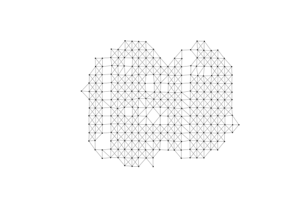
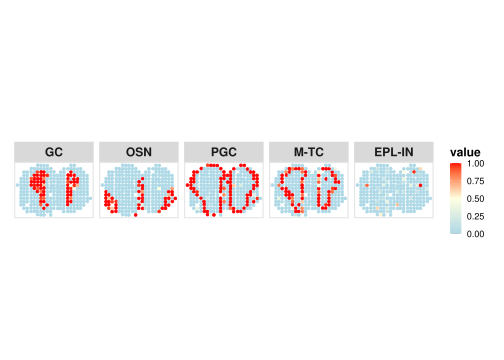
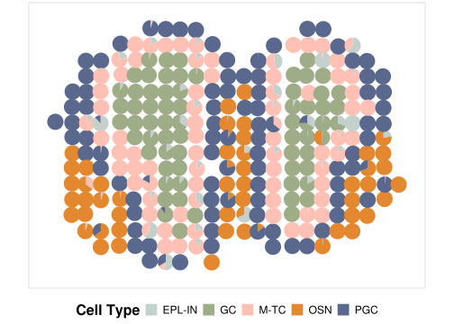

<!-- README.md is generated from README.Rmd. Please edit that file -->

# SPECTRUM

<!-- badges: start -->
<!-- badges: end -->

The goal of SPECTRUM(Spatial Pattern Enhanced Cellular and Tissue
Recognition Unified Method) is to combine inclusive prior known
cell-type specific markers and spatial weighting for cell-type
identification and spatial community detection.

## Installation

You can install the development version of SPECTRUM like so:

``` r
library(devtools)
devtools::install_github("WYucen/SPECTRUM")
```

## Example

This is a basic example that demonstrates how to perform cell type
deconvolution using SPECTRUM:

``` r
library(SPECTRUM)
#> 
#> Attaching package: 'SPECTRUM'
#> The following object is masked from 'package:stats':
#> 
#>     integrate

# Load example data
data("mob_demo_data")
markerList <- mob_demo_data$markerList
st_data <- mob_demo_data$st_mtx
position <- mob_demo_data$st_pos

# Set preprocessing parameters
minGene <- 100
minSpot <- 5

# Preprocess the spatial count matrix
st_data <- pre_process(st_data = st_data, minGene = minGene, minSpot = minSpot)
#> ## Before filtering 
#> ## Number of genes: 17812  
#> ## Number of spots: 278  
#> --------------------------------
#> ## After filtering 
#> ## Number of genes: 13319  
#> ## Number of spots: 278
position <- position[colnames(st_data), ]  # Match position with filtered spots

# Plot Gabriel graph for spatial neighborhood structure
check_graph(position, data_struct = "dist", dist.th = 1.5, vertex.size = 1, ratio = 0.8)
```



    #> NULL

    # Perform deconvolution
    pre_prop <- deconvo_process(
      st_data = st_data,
      location = position,
      data_struct = "dist",
      dist.th = 1.5,
      markerList = markerList
    )
    #> ## Caculating threshold done ...
    #> ## Constructing graph done ...
    #> ## Caculating localization score done ...
    #> --------------------------------
    #> ## Number of unique marker genes: 883 for 5 cell types ...
    #> [1] 13319   278
    #> [1] 804 278
    #> ## Number of process marker genes: 804 for 5 cell types ...
    #> --------------------------------
    #> ## Start NMF: it takes a while ...
    #> ## Time for training:  0.13 min
    #> ## NMF DONE!
    #> ## Start generating proportion matrix
    #> ## Proportion matrix DONE

    # Inspect result
    head(pre_prop)
    #>              GC OSN PGC M-TC EPL-IN
    #> 7.962x22.994  0   0   1    0      0
    #> 9.004x17.028  0   1   0    0      0
    #> 9.018x20.048  0   1   0    0      0
    #> 9.023x19.044  0   1   0    0      0
    #> 9.03x23.949   0   0   1    0      0
    #> 9.049x18.018  0   1   0    0      0

    # Visualize deconvolution proportions
    plot_ct(
      proportion = pre_prop,
      position = position,
      ct.select = colnames(pre_prop),
      NumCols = 5
    )



``` r

# Visualize spatial cell type distribution with pie charts
plot_pie(
  proportion = pre_prop,
  position = position,
  cols = mob_demo_data$ct_cols
)
```


